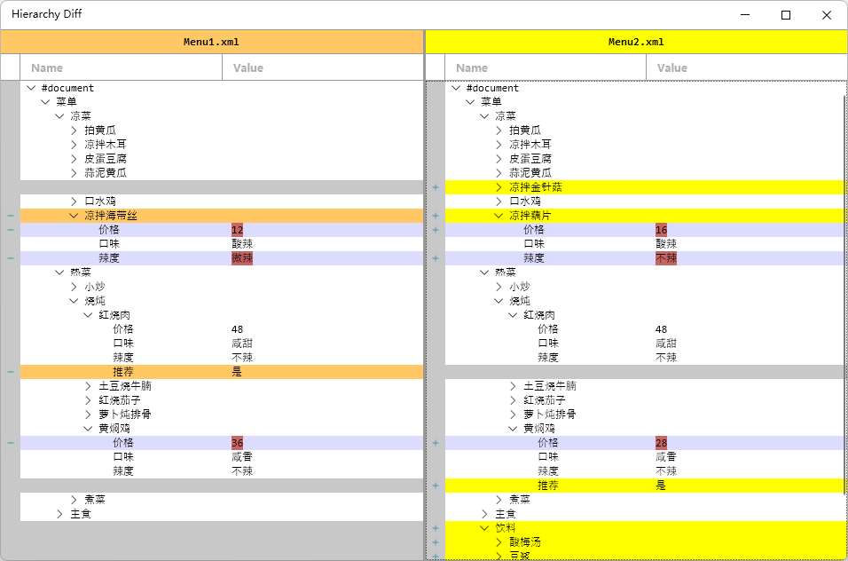
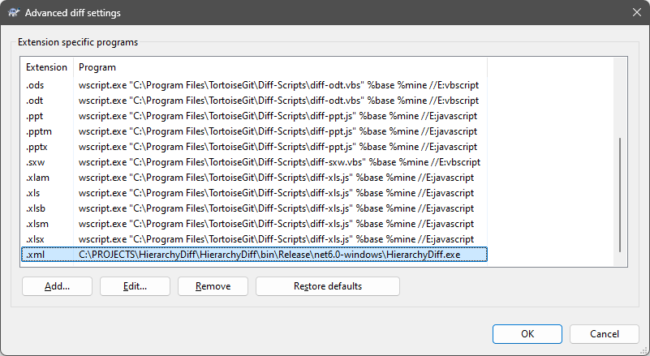

# HierarchyDiff

[English](https://github.com/9087/HierarchyDiff) | **简体中文**

这是一款基于WPF的树形数据差异查看工具：



## 用法

使用如下命令可以比较两个文件：

```Powershell
HierarchyDiff.exe <文件路径1> <文件路径2>
```

因此也可以配置到版本控制工具（例如TortoiseGit）中，为`*.xml`格式提供定制的Diff功能：



## 拓展

本项目提供了`FileFormat`类型作为“文件类型”的基类。通过继承该类可以描述更多的树形数据文件类型。具体步骤如下：

* 参考`HierarchyDiff.FileFormat.Xml`工程创建一个新文件类型的`Class Library`工程。
* 继承`FileFormat`并实现其中的纯虚函数即可。

**加载文件**

```C#
public abstract object? Load(string filePath);
```

加载文件，返回一个能够描述该文件的对象。后续会在其他接口中通过该对象获取树形数据信息。

**保存文件**

```C#
public abstract void Save(object document, string filePath);
```

保存文件，用于文档编辑后的存盘。

**获取根节点**

```C#
protected abstract object GetRoot(object document);
```

获取根节点。参数为`Load`方法返回的描述该文件的对象。

**获取某个节点的子节点**

```C#
protected abstract IEnumerable<object> GetChildren(object node);
```

获取某个节点的子节点。特别需要说明的是：例如在XML中存在`元素`和`属性`两个概念，本工具并不会区分此二者。也就是说该函数也需要枚举出XML的`属性`，`属性`被当作没有子孙的叶子节点。

**比较两个节点**

```C#
public abstract float Compare(object a, object b);
```

传入的参数是两个节点。返回值为浮点型，用来描述两者的匹配程度。通常返回值应该处于[0, 1]区间中。以XML文件类型为例：

```C#
public override float Compare(object a, object b)
{
	if (a == null || b == null) return a == b ? 1 : 0;
	if (a.GetType() != b.GetType()) { return 0; }
	switch (a)
	{
		case XmlElement:
		{
			var element0 = (XmlElement)a;
			var element1 = (XmlElement)b;
			return
				element0.Name == element1.Name
				? 1
				: 0;
		}
		case XmlAttribute:
		{
			var attribute0 = (XmlAttribute)a;
			var attribute1 = (XmlAttribute)b;
			if (attribute0.Name != attribute1.Name) return 0.1f;
			if (attribute0.Value != attribute1.Value) return 0.5f;
			return 1;
		}
		case XmlDocument:
		{
			return 1;
		}
		default:
			throw new NotSupportedException();
	}
}
```

当返回值为0时表示两者完全不匹配，为1时表示两者完全匹配。例如上述代码，节点类型不一致时则直接返回0。当类型同为`XmlElement`，元素名称一致时返回1，否则返回0。而如果类型同为`XmlAttribute`，属性名称不一致返回0.1，表示在`Attribute`名称不一致时可能被识别成“被修改”，而不是删除掉原有的`Attribute`后再添加新的，从而实现一定程度的模糊匹配。具体的返回值，可以根据实际的情况进行调整。

**将节点转换成字符串**

```C#
public abstract string ToString(object? node);
```

多用于调试。

**获取节点的名称**

```C#
public abstract string GetName(object? node);
```

**获取节点的值**

```C#
public abstract string? GetValue(object? node);
```

获取节点的值。本项目暂时没有区分值的类型，所有的值都是字符串。

**设置节点的值**

```C#
public abstract bool SetValue(object? node, string value);
```

**获取节点的显示样式**

```C#
public abstract TreeNodeStyle GetStyle(object? node, TreeNodeStyle? style);
```

可以为节点定制显示样式（包括字体、字号、行高等属性）。传入的参数是默认样式，如需定制可以新创建一个`TreeNodeStyle`类型的对象，将必要的属性数据改写后返回。

## TODO
- [ ] 节点以及属性的增加、删除、修改
- [ ] 合并